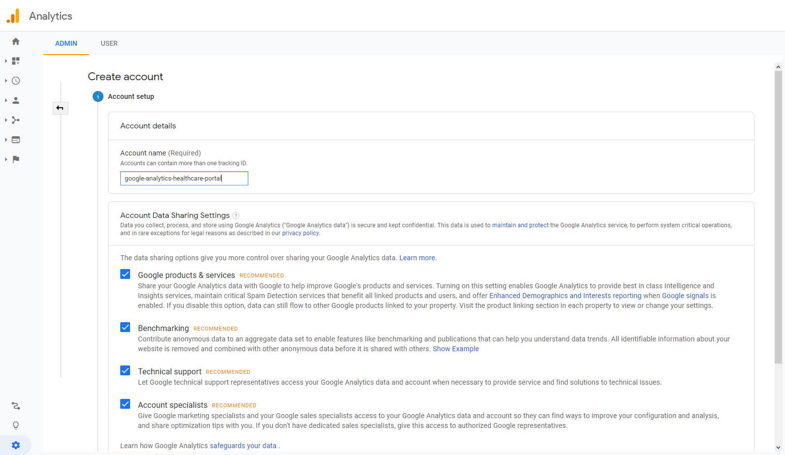
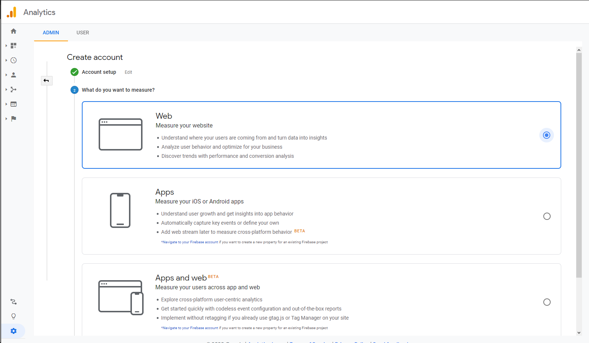
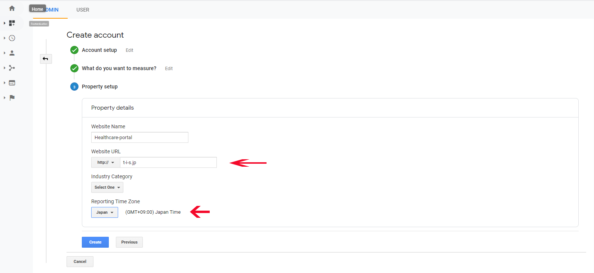
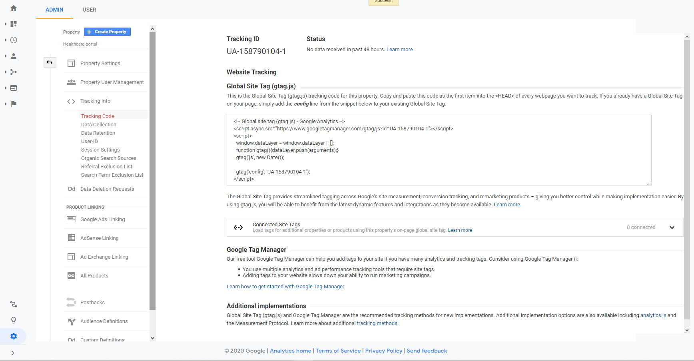
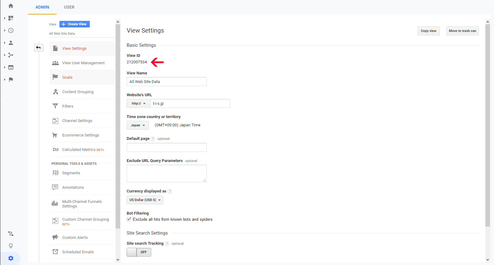
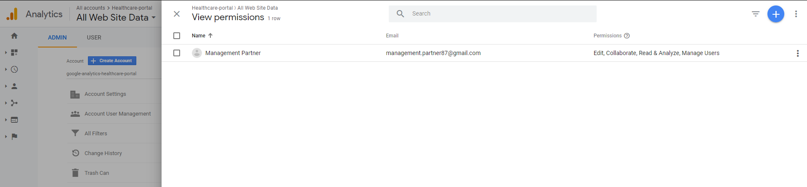
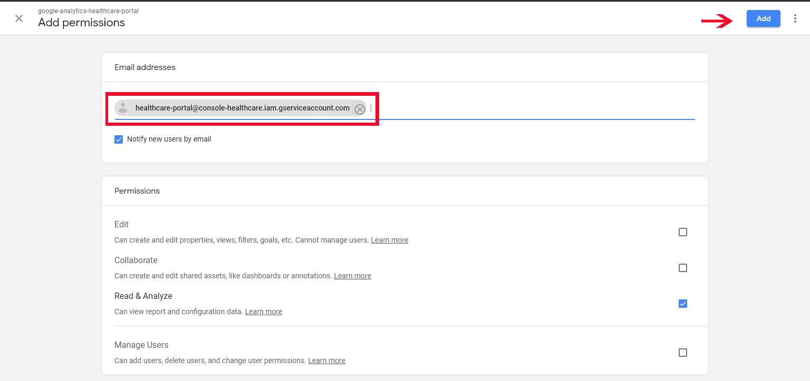

```
Google Analytics Account တည်ဆောက်ခြင်း
acc name ထည့်ပြီး Next နိုပ်ပါ
```

```
ကျနော်တို့ web project အတွက် လုပ်မှာ ဖြစ်တဲ့အတွက် web ကိုပဲရွေးပါမယ်
ပြီးရင် next နိုပ်ပါ
```

```
Property details မှာ website name ကြိုက်တာပေးပါ
website url မှာ ကိုယ် tracking လုပ်မယ့် site address ထည့်ပါ
industry category မရွေးလဲရပါတယ်
Reporting Time Zone က တော့ healthcare-portal အတွက် မို့လို့ JAPAN ပဲ ရွေးထားပါတယ်
ပြီးရင် Create နိုပ်ပါ
```

```
Create နိုပ်ပြီးတာနဲ့ ကျနော်တို့ analytics acc တခုရပါပြီ
အ့ဒီမှာ Tracking ID ( UA-XXXXXX-X) နဲ့ Global Site tag ရပါမယ်
Tracking ID က vue analytics package install လုပ်တဲ့ အခါ app.js မှာ ထည့်ပေးရမှာပါ
Global site tag က laravel ရဲ့ app.blade.php မှာ <header> tag အတွင်း ထည့်ပေးရပါမယ်
```

```
View Settings ထဲ က View ID ကို laravel ရဲ့ .env file မှာ
***ANALYTICS_VIEW_ID=212007534*** ထည့်ပေးရပါမယ်
```

```
Account User Management ထဲဝင်ပါ
Add user ကိုနိုပ်ပြီး google console မှ user ကို permission ပေးဖို့ထည့်ပါမယ်
google console api မှာ user ကို ထည့်ပြီး add နိုပ်ပါ
```




--------------------------------------------------------------------------------------
**Create Event Report**


<!--stackedit_data:
eyJoaXN0b3J5IjpbMTgyMTk5NjQxMywxMjI0Mjc0ODM3LC05MD
k1MDY3MzYsNzk2NDkxMjc3LDE3MTkyMTEwOTAsLTExNTQwNDAy
MDksLTE3ODg3OTg0MjUsLTEyNzEwMDYyNDMsMTk5MjAwODc0OC
wxMDgwNzMxMjM5LDIwMzY2MDg1NDksNjI1NTYwNDAxXX0=
-->