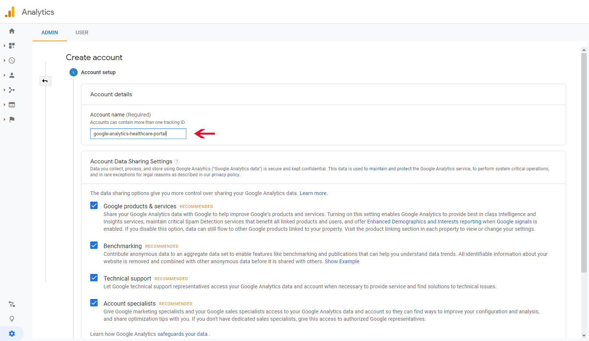
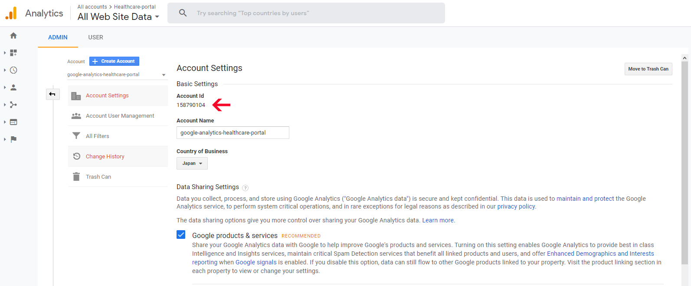

```
Google Analytics Account တည်ဆောက်ခြင်း
acc name ထည့်ပြီး Next နိုပ်ပါ
```

```
ကျနော်တို့ web project အတွက် လုပ်မှာ ဖြစ်တဲ့အတွက် web ကိုပဲရွေးပါမယ်
ပြီးရင် next နိုပ်ပါ
```

```
Property details မှာ website name ကြိုက်တာပေးပါ
website url မှာ ကိုယ် tracking လုပ်မယ့် site address ထည့်ပါ
industry category မရွေးလဲရပါတယ်
Reporting Time Zone က တော့ healthcare-portal အတွက် မို့လို့ JAPAN ပဲ ရွေးထားပါတယ်
ပြီးရင် Create နိုပ်ပါ
```

```
Create နိုပ်ပြီးတာနဲ့ ကျနော်တို့ analytics acc တခုရပါပြီ
အ့ဒီမှာ Tracking ID ( UA-XXXXXX-X) နဲ့ Global Site tag ရပါမယ်
Tracking ID က vue analytics package install လုပ်တဲ့ အခါ app.js မှာ ထည့်ပေးရမှာပါ
Global site tag က laravel ရဲ့ app.blade.php မှာ <header> tag အတွင်း ထည့်ပေးရပါမယ်
```




<!--stackedit_data:
eyJoaXN0b3J5IjpbMTcxOTIxMTA5MCwtMTE1NDA0MDIwOSwtMT
c4ODc5ODQyNSwtMTI3MTAwNjI0MywxOTkyMDA4NzQ4LDEwODA3
MzEyMzksMjAzNjYwODU0OSw2MjU1NjA0MDFdfQ==
-->