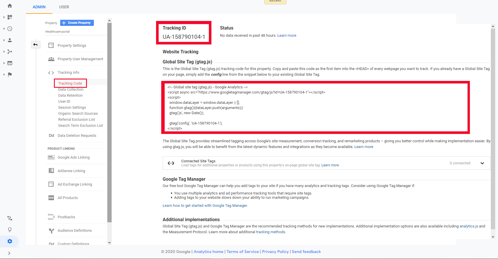

```
Google Analytics Account တည်ဆောက်ခြင်း
acc name ထည့်ပြီး Next နိုပ်ပါ
```

```
ကျနော်တို့ web project အတွက် လုပ်မှာ ဖြစ်တဲ့အတွက် web ကိုပဲရွေးပါမယ်
ပြီးရင် next နိုပ်ပါ
```

```
Property details မှာ website name ကြိုက်တာပေးပါ
website url မှာ ကိုယ် tracking လုပ်မယ့် site address ထည့်ပါ
industry category မရွေးလဲရပါတယ်
Reporting Time Zone က တော့ healthcare-portal အတွက် မို့လို့ JAPAN ပဲ ရွေးထားပါတယ်
ပြီးရင် Create နိုပ်ပါ
```





<!--stackedit_data:
eyJoaXN0b3J5IjpbLTE3ODg3OTg0MjUsLTEyNzEwMDYyNDMsMT
k5MjAwODc0OCwxMDgwNzMxMjM5LDIwMzY2MDg1NDksNjI1NTYw
NDAxXX0=
-->