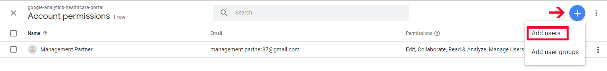
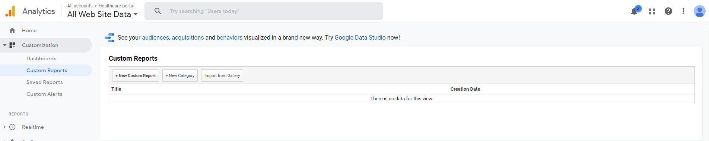
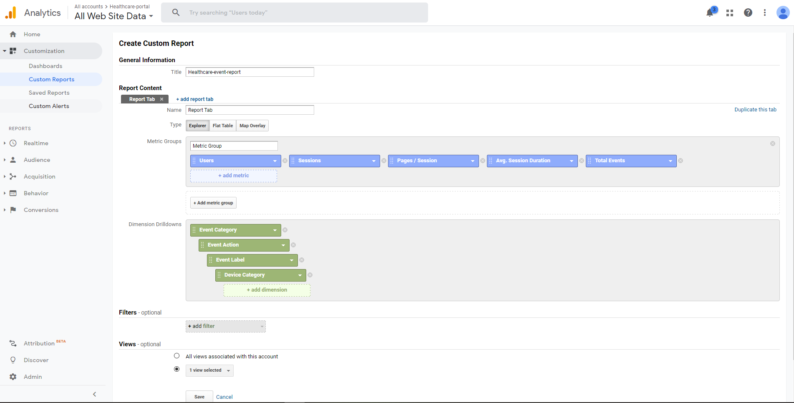

```
Google Analytics Account တည်ဆောက်ခြင်း
acc name ထည့်ပြီး Next နိုပ်ပါ
```

```
ကျနော်တို့ web project အတွက် လုပ်မှာ ဖြစ်တဲ့အတွက် web ကိုပဲရွေးပါမယ်
ပြီးရင် next နိုပ်ပါ
```

```
Property details မှာ website name ကြိုက်တာပေးပါ
website url မှာ ကိုယ် tracking လုပ်မယ့် site address ထည့်ပါ
industry category မရွေးလဲရပါတယ်
Reporting Time Zone က တော့ healthcare-portal အတွက် မို့လို့ JAPAN ပဲ ရွေးထားပါတယ်
ပြီးရင် Create နိုပ်ပါ
```

```
Create နိုပ်ပြီးတာနဲ့ ကျနော်တို့ analytics acc တခုရပါပြီ
အ့ဒီမှာ Tracking ID ( UA-XXXXXX-X) နဲ့ Global Site tag ရပါမယ်
Tracking ID က vue analytics package install လုပ်တဲ့ အခါ app.js မှာ ထည့်ပေးရမှာပါ
Global site tag က laravel ရဲ့ app.blade.php မှာ <header> tag အတွင်း ထည့်ပေးရပါမယ်
```

```
View Settings ထဲ က View ID ကို laravel ရဲ့ .env file မှာ
***ANALYTICS_VIEW_ID=212007534*** ထည့်ပေးရပါမယ်
```

```
Account User Management ထဲဝင်ပါ
Add user ကိုနိုပ်ပြီး google console မှ user ကို permission ပေးဖို့ထည့်ပါမယ်
google console api မှာ user ကို ထည့်ပြီး add နိုပ်ပါ
```



--------------------------------------------------------------------------------------
**Create Event Report**
```
Event Report တင်မဟုတ်ပါ တခြား report များလဲ ထုတ်လို့ပါတယ်
ဒီမှာတော့ Category အလိုက် News Details ရဲ့ View count ကို report လုပ်ထားတာပါ
Customization ထဲက Custom Reports ကိုသွားပါ ။ New Custom Report ကိုနိုပ်ပါ
```

```
Title ကိုကြိုက်တာပေးပါ Metric နဲ့ Dimension ကို ပုံပါအတိုင်ပေးပြီး ကျန်တာ ဒီအတိုင်းထားလိုက်ပါ
ပြီးရင် Save နိုပ်ပါ 
** google analytics ရဲ့ report မှာဆိုရင် Report data က ၁၅မိနစ်ကနေ ၄၈နာရီ အထိ ကြာတတ်ပါတယ် ၊ 
```





**google analytics ထဲ Event ထည့်နည်းကို [vue-analytics](vue.analytics.md) မှာ ရှင်းပြထားပါတယ်**
<!--stackedit_data:
eyJoaXN0b3J5IjpbMTUyMDE5Mzk4OSw0NTAzODQ0MDYsLTM5MT
czODM3NSwtMTU1MDk5NDE4NCw5MzUxODgyLDEyMjQyNzQ4Mzcs
LTkwOTUwNjczNiw3OTY0OTEyNzcsMTcxOTIxMTA5MCwtMTE1ND
A0MDIwOSwtMTc4ODc5ODQyNSwtMTI3MTAwNjI0MywxOTkyMDA4
NzQ4LDEwODA3MzEyMzksMjAzNjYwODU0OSw2MjU1NjA0MDFdfQ
==
-->