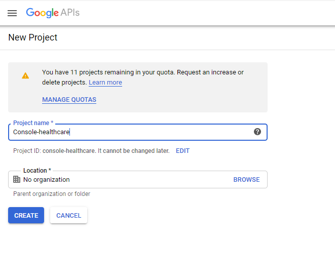
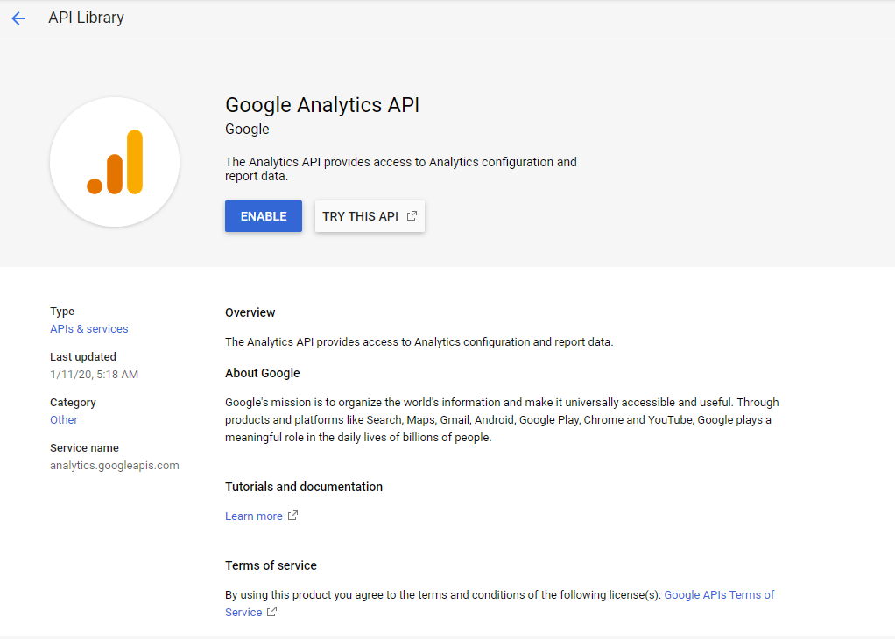
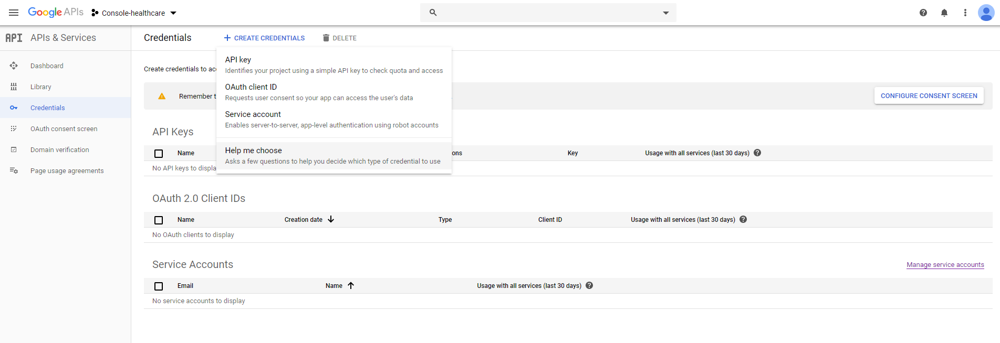
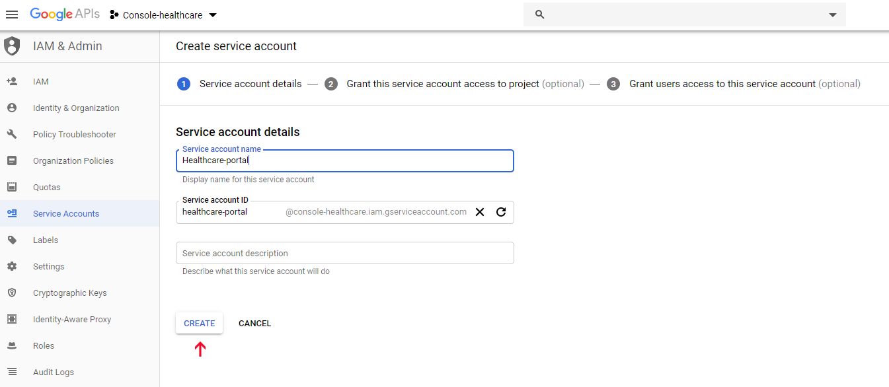
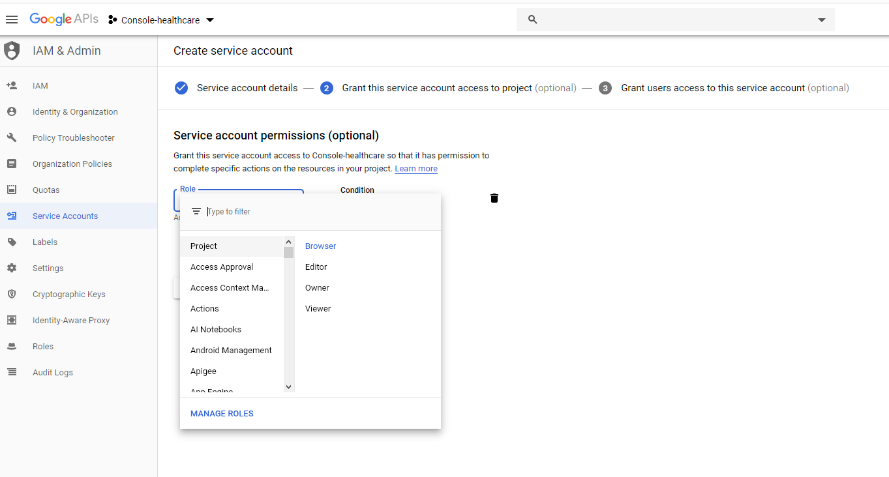
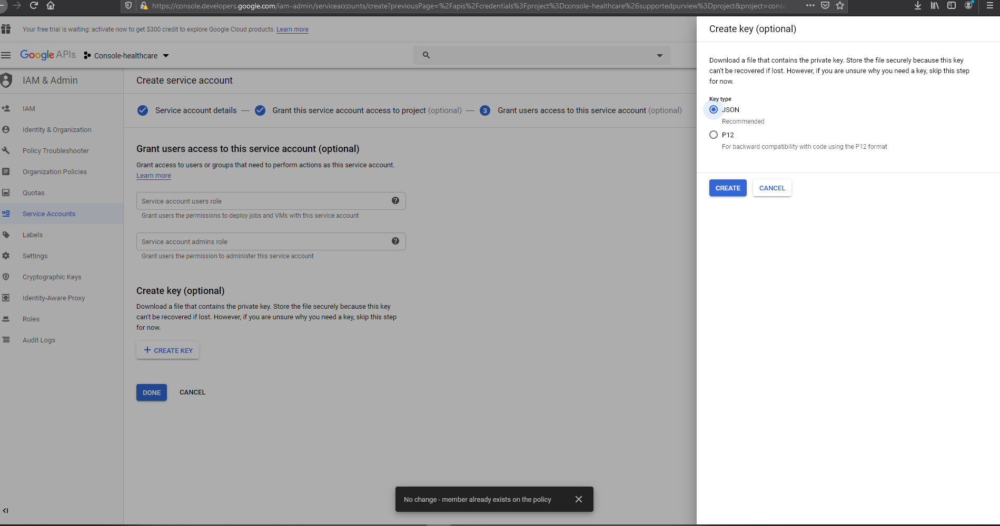
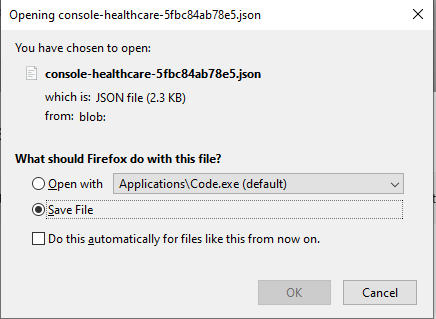
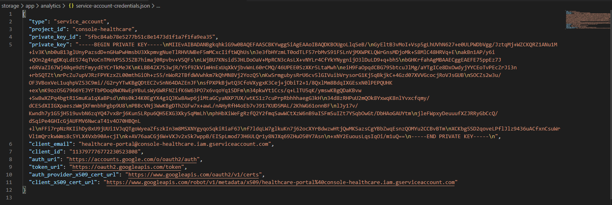
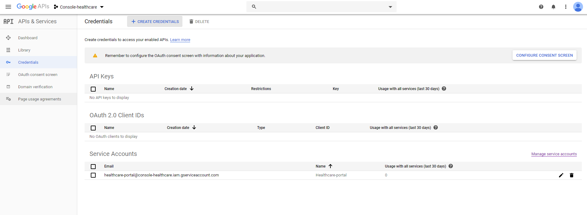

 > **[Google API’s site](https://console.developers.google.com/apis/)**
  login with gmail account
  
Project တခု ရေးပြီး Create နိုပ်ပါ :grin:

Create နိုပ်ပြီးရင် ကျနော်တို့ Project ရဲ့ Dashboard ကို ရောက်သွားပါပြီ  
အ့ဒီမှာ google analytics ရဲ့ api ကို enable လုပ်ဖို့ပေးရမယ်

Enable apis and services ကို နိုပ်ပါပြီးရင် Search box မှာ google analytics api လို့ရိုက်ရှာပြီး enable နိုပ်ပါ

<!--stackedit_data:
eyJoaXN0b3J5IjpbMTU3NzQ0Nzc2MywtMTg5MDQxNjU5NiwtND
A5NzU5MzA3LDE2ODU2NjIzMDcsNzMwOTk4MTE2XX0=
-->