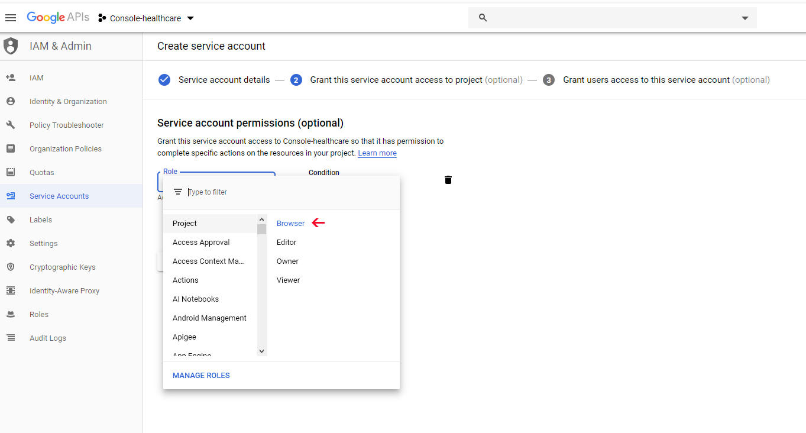
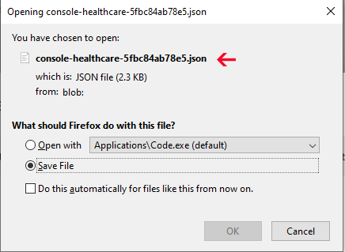

 > **[Google API’s site](https://console.developers.google.com/apis/)**
  login with gmail account
```
Project  name တခု ရေးပြီး Create နိုပ်ပါ
```

```
Create နိုပ်ပြီးရင် ကျနော်တို့ Project ရဲ့ Dashboard ကို ရောက်သွားပါပြီ 
အ့ဒီမှာ google analytics ရဲ့ api ကို enable လုပ်ဖို့ပေးရမယ်
```

```
Enable apis and services ကို နိုပ်ပါပြီးရင် Search box မှာ google analytics api လို့ရိုက်ရှာပြီး enable နိုပ်ပါ
```

```
google analytics api  ကို enable လုပ်ပြီးရင် key ရယူဖို့အတွက် 
Credentials ကိုသွားပါမယ်  
create credentials ထဲက service account ကိုနိုပ်ပါ
```

```
service account တခုဆောက်ပါမယ် 
service account name ကိုကြိုက်တာပေးလို့ရပါတယ်
ကိုယ်ပေးလိုက်တဲ့ name မှ service account ID (client_email) ရပါမယ်
create ကိုနိုပ်ပါ
```

```
ဒီအဆင့် Role သတ်မှတ်ပေးရပါမယ် ကျနော်တို့က Browser အတွက်သုံးပြုမှာ ဖြစ်တဲ့အတွက် Browser ကိုရွေးပါမယ် <br>
continue နိုပ်ပါ
```

```
key ယူဖို့အတွက် Create Key ကိုနိုပ်ပါ 
type ကတော့ json format ယူမှာ ဖြစ်လို့ JSON ကို ရွေးပြီး Create နိုပ် down ဖို့အတွက် ကျလာပါလိမ့်မယ်
```



```
အောက်ပါပုံအတိုင်း json data ရလာပါလိမ့်မယ်
```

```
vendor public လုပ်ပြီးရင် config/analytics.php file ထဲမှာ
အောက်ပါ storage path အတိုင်း key file ကို ထည့်ပေးရပါမယ်
```


<!--stackedit_data:
eyJoaXN0b3J5IjpbLTEzMTkyMDE3OTMsMzU4MDM0MDI1LDEzMj
Q4ODE0MjMsLTEzMDE4NjcwMDgsLTExODk0MTkwNzAsLTQ2OTQ1
NDQxNyw4MTU1MDYxNjUsLTIzNjk4MzAzNCwtMTg5MDQxNjU5Ni
wtNDA5NzU5MzA3LDE2ODU2NjIzMDcsNzMwOTk4MTE2XX0=
-->